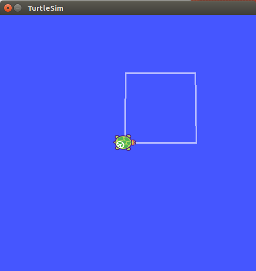

# Mobile Robot lab1

* __AUTHOR__: Tsung-Han Lee
* __DESCRIPTION__: nodejs implementation of lab1 which merely control the contour of `turtlesim_node`

---
## Prerequisites
1. __<a href="http://wiki.ros.org/kinetic/Installation/Ubuntu">ROS Kinetic</a>__
2. __<a href="https://nodejs.org/en/download/package-manager/">Nodejs</a>__ (version 6.x is recommended)

## Usage
Clone from github
```
1 $ git clone https://github.com/bobolee1239/mobileRobot.git
2 $ cd lab1_nodejs
3 $ npm install
```
@ Terminal 1 :
```
1 $ source ~/catkin_ws/devel/setup.bash
2 $ roscore
```
@ Terminal 2:
```
1 $ source ~/catkin_ws/devel/setup.bash
2 $ rosrun turtlesim turtlesim_node
```
@ Terminal 3:
```
1 $ source ~/catkin_ws/devel/setup.bash
2 $ rosrun lab1_nodejs turtleBoss.js
```
## Results
<div style="width: 50vw; margin: 0 auto;">
    
</div>

# Reference
1. <a href="https://github.com/RethinkRobotics-opensource/rosnodejs_examples">Rethink Robotics</a>
2. <a href="https://www.npmjs.com/package/rosnodejs">npm rosnodejs</a>
